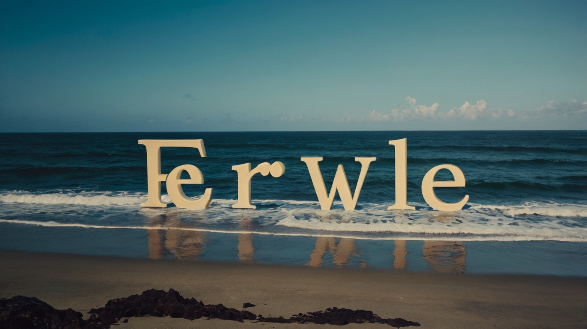

 &nbsp;

- 👨‍💻 Qantesm, kod satırlarının arasında kaybolmaktan büyük keyif alan, kendi halinde bir yazılımcı. İlhamını, bir gün bir parkta yürürken aklına gelen bir oyun fikrinden veya sabah kahvesini yudumlarken okuduğu bir haberden alırdı. Projeleri, her zaman biraz tuhaf, biraz deneysel ve tamamen kendineydi. Çoğu zaman bu projelerin sonu, internetin karanlık köşelerinde unutulmuş GitHub depolarına çıkardı. Ama bu Qantesm'in umurunda değildi. Onun için önemli olan tek şey, kod yazmanın ve kendi yarattığı dünyalarda kaybolmanın verdiği saf mutluluktu.

## 💻 Teknoloji Yığınım:

## 🏆 My Stats:

    &nbsp;&nbsp;
    &nbsp;&nbsp;

